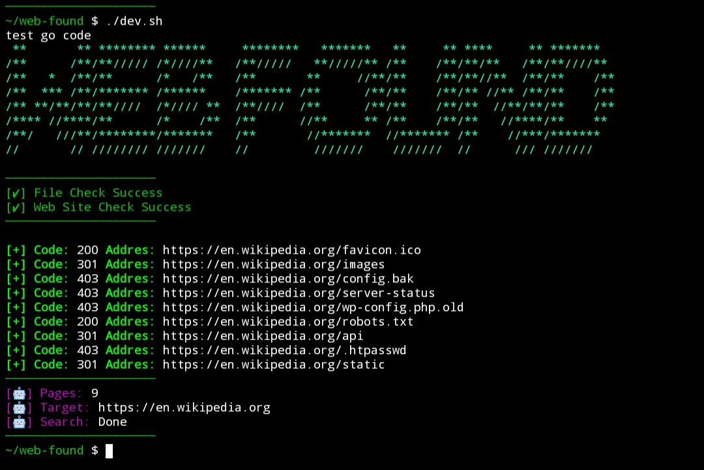

# Web FOUND

[](#)


**Fast & Simple Web Content Discovery**

Find what the web server doesn't want you to see.
Hidden dirs, backup files, admin panels - all in one scan.

## Features ✨
- **Fast HEAD Requests** - Low bandwidth scanning
- **Status Code Detection** - 200, 301, 403, 404
- **Custom Wordlist** - Use any txt wordlist
- **Lightweight** - Single binary, no dependencies
- **Clean Output** - With banner and summary

----
## Installation 
Go to **[Release](https://google.com)** Page & Download Binary File 

### Downloads
| Architecture | Windows | Linux |
| :--- | :---: | :---: |
| **x86_64 / amd64** | [Download](https://github.com/Ruwantha-OFFICIAL/Web-Found/releases/download/1.0.0v/web-found_windows_amd64.zip) | [Download](https://github.com/Ruwantha-OFFICIAL/Web-Found/releases/download/1.0.0v/web-found_linux_amd64.tar.gz) |
| **aarch64 / arm64** | [Download](https://github.com/Ruwantha-OFFICIAL/Web-Found/releases/download/1.0.0v/web-found_windows_arm64.zip) | [Download](https://github.com/Ruwantha-OFFICIAL/Web-Found/releases/download/1.0.0v/web-found_linux_arm64.tar.gz) |
| **x86 / 386** | [Download](https://github.com/Ruwantha-OFFICIAL/Web-Found/releases/download/1.0.0v/web-found_windows_386.zip) | [Download](https://github.com/Ruwantha-OFFICIAL/Web-Found/releases/download/1.0.0v/web-found_linux_386.tar.gz) |

### Linux Setup 
```bash
chmod +x web-found
./web-found
```

### Windows Setup

```powershell
.\web-found.exe
```

---

## Usage 🧾

```bash
./web-found.exe -url https://en.wikipedia.org -word webco.txt
```
### Options 🐾

- **url**: Rconsens Website Url/Domain Name
- **word**: You Provide Word List  `wordlist.txt/webco.txt`
- **r**: Redirect mode false

---

Copyright 2026 Lasith Ruwantha Amarawansha